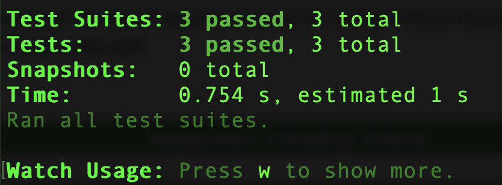

Test results for NotFound, Profile and TodoDetail components:

1. Use following command to create database using prisma:
npx prisma init
npx prisma migrate dev --name init
npm install @prisma/client
npx prisma studio
npx prisma db push

Commands to manage mysql:
mysql -u root -p
show databases;
DROP DATABASE todo;
DROP DATABASE `to-do`;

2. Use this command to run api:
npx nodemon index.js

3. Use this command to run client:
npm run start

4. google cloud
The steps to install it using the Google Cloud SDK installer are:

Enter the following at a command prompt:
curl https://sdk.cloud.google.com | bash

(remain .zshrc path as default)
Restart your shell:
exec -l $SHELL

Run gcloud init to initialize the gcloud environment:
gcloud init
gcloud app create
gcloud app deploy

gcloud app browse ?

5. planet scale:
https://planetscale.com/docs/tutorials/planetscale-quick-start-guide
macOS
pscale is available via a Homebrew Tap, and as downloadable binary from the releases page:

brew install planetscale/tap/pscale
Optional: pscale requires the MySQL Client for certain commands. You can install it by running:

brew install mysql-client

To upgrade to the latest version:
brew upgrade pscale

6. vercel:
npm install vercel
npm --version

To redeloy client:
vercel --prod

